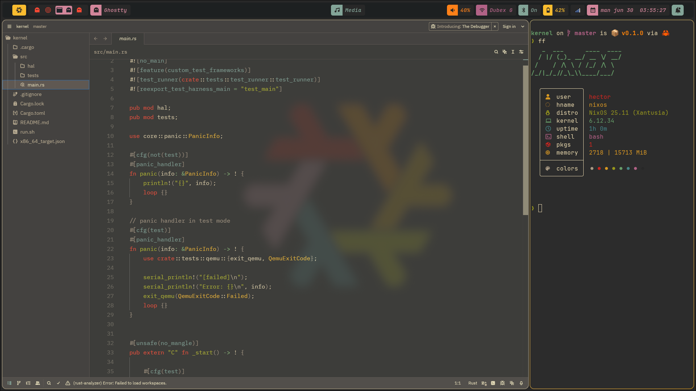

# GruvBox Themed Dotfiles
These are my Gruvbox dotfiles for nixos. 




# Programs
- Hyprland
- Hyprpapr
- Hyprpanel
- Wofi
- Ghostty
- Tmux
- Neovim
- Zen-Browser

# Setup
```bash
git clone https://github.com/HectorSchreiner/.dotfiles
rm ~/.dotfiles/hardware-configuration.nix
cp /etc/nixos/hardware-configuration.nix ~/.dotfiles
sudo nixos-rebuild switch --flake ~/.dotfiles#nixos
```
I personally use Stow to manage my symlinks, you can use the following command, to link all the files to `~/.config`:
```bash
cd ~/.dotfiles/
stow nvim ghostty hypr hyprpanel wofi tmux
```

To remove the symlinks use:
```bash
cd ~/.dotfiles/
stow -D nvim ghostty hypr hyprpanel wofi tmux
```
